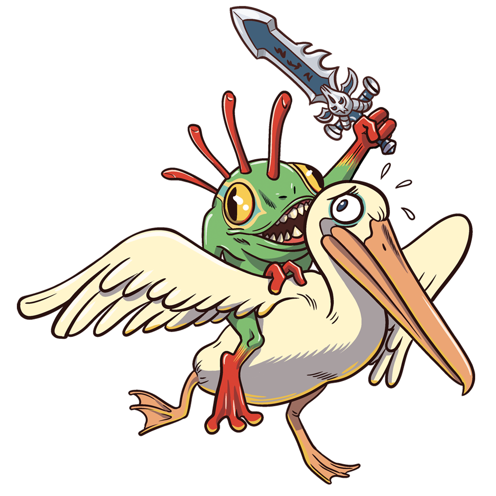

# Pelican UI

Projet expérimental.

Add-on pour la guilde Pélican sur world of warcraft.

## Memos

Activer / Désactiver l'affichage des erreurs in-game :

`/console scriptErrors 0`  
`/console scriptErrors 1`

Créer un lien symbolique pour le dossier AddOns :

Lancer commande en mode administrateur :  
`mklink /D "C:\Program Files (x86)\World of Warcraft\_retail_\Interface\AddOns\pelicanUI" "F:\Documents\Workspace\wow-addon\pelicanUI"`

## Informations pratiques

**Taille des images pour Emoji** : 32x32 (format TGA)  
**Taille des images pour Award** : 1000x1000 (format PNG)
